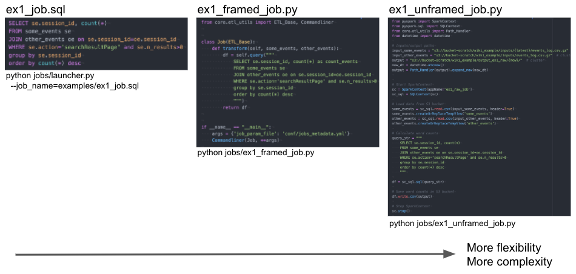

Concepts
========

.. autosummary::
   :toctree: generated

Definition of a job
-------------------

A job is a transformation typically taking one or several input datasets, and generating one output dataset. In some cases, the transformation may have no input datasets, and may generate more than 1 output dataset.

A job can be written in SQL, or in python using framework classes, or in python without using framework classes. The 3 files below showcase these 3 ways of coding jobs in Yaetos. The 3 jobs below achieve the exact same transformation. It shows how a simple job can be written in a concise way, just using a .sql file, not requiring any knowledge of python nor spark. For more complex cases, the jobs can be coded in python, getting access to the full flexibility of spark and python. It is typically useful for API extraction jobs, for machine learning jobs, or for jobs with parts of transformations is common.

Definition of a pipeline
------------------------

A pipeline is a set of jobs running together because of dependencies. The dependencies need to be defined in the job registry file. See more details on this below.

The job registry
------------------------

The job manifest is a yaml file containing the list of jobs, together with the main parameters for each jobs, such as scheduling details, dependencies, etc.
Most parameters can also be defined in the job files. The dependency parameters have to be defined in this file.

..
  .. code:: python

     import asyncio
     from aiobotocore.session import get_session

     AWS_ACCESS_KEY_ID = "xxx"
     AWS_SECRET_ACCESS_KEY = "xxx"

   comment:: add a snapshot of an example or a code block!
