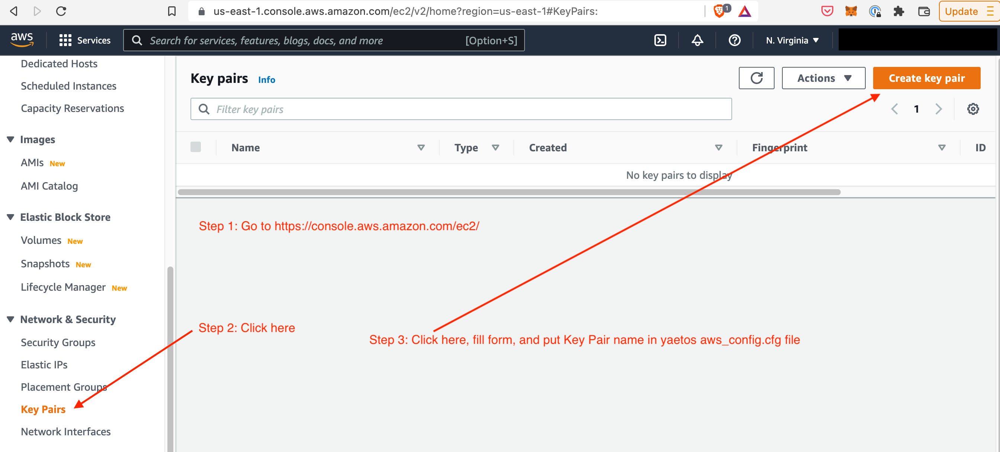

Installation
============

.. _installation:

Installation to run locally
---------------------------

Follow the steps below to install the library, create a job folder and execute them in a docker environment:

.. code-block:: console

   $ pip install yaetos
   $ cd /path/to/an/empty/folder/that/will/contain/pipeline/code
   $ yaetos setup  # to create sub-folders and setup framework files.
   $ yaetos launch_env # to launch the docker container
   # From inside the docker container, try a test pipeline with
   $ python jobs/examples/ex1_frameworked_job.py --dependencies

Installation to push jobs to the cloud
--------------------------------------

To get jobs executed and/or scheduled in AWS, You need to:
 * Get permissions setup in AWS to access: S3 (at least 1 bucket), EMR, AWS Secrets, AWS Data Pipeline, and AWS Airflow
 * fill AWS parameters in `conf/config.cfg`. More details below.
 * have `~/.aws/` folder setup to give access to AWS secret keys. If not, run `pip install awscli` and `aws configure`, adding `--profile=your_profile` if a profile is already registered in AWS CLI.

If not available, the "Key Pair" parameter from the `conf/config.cfg` can be created following the instructions at https://docs.aws.amazon.com/AWSEC2/latest/UserGuide/create-key-pairs.html.
It involves going to https://console.aws.amazon.com/ec2/.

